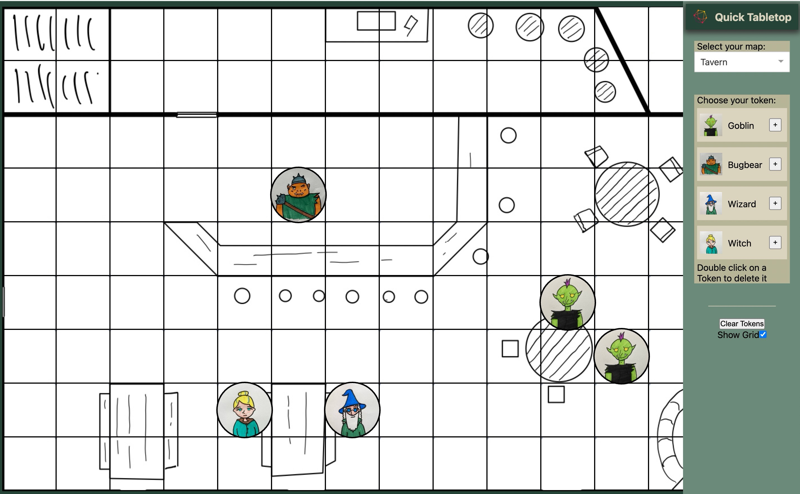

# Quick Tabletop

A Mock Virtual Tabletop.

You can open it on your browser at: [quik-tabletop](https://quick-tabletop.onrender.com) and play around with it

## Single Session - no persistency

This is a toy-model of the frontend, not an actual VTT. Meaning nothing is persistent.
If you refresh you will lose your changes.

You can not have multiple players accessing and editing the same sessions, as there is currently no backend connected to it.
