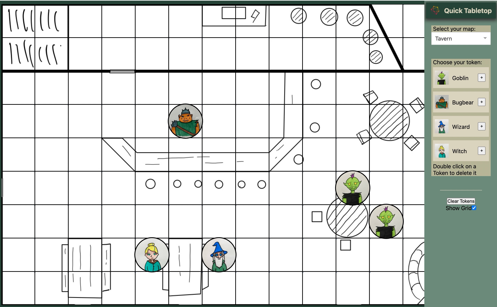

# Quick Tabletop

A virtual tabletop I'm building for fun!

You can try it out in your browser at [QuickTabletop](http://impproductions.org:8080/).

## Sessions

Sessions are handled by a backend written in Go. Users can connect to a session to simultaneously access its resources and move things around.

Since this is a fun side project deployed on a small VPS, there are hard limits on the number of concurrent sessions and the number of players per session.

The session ID is what identifies a session - having the ID grants access to it and allows you to retrieve its persisted state.

This is a pet project in active development, not production-ready software. I make no guarantees about data persistence: I may clear the database from time to time, and any persisted sessions will be gone.

## Assets

The default asset pack is the only one currently available. I'm working on an asset manager to provide:

- a larger asset selection
- the ability to add personal assets
- a better UX for managing assets

## Status

This project is currently paused — I'm parking it for a few months before picking it back up.

